# AirHub-Beijing · 京翼机场中枢


> 一个从 0 到 1 动手制作的数据可视化大屏开源项目，用于帮助理解数据大屏的完整构建流程。


---

## 项目简介

| 属性 | 说明 |
| --- | --- |
| **项目英文名** | AirHub-Beijing |
| **项目中文名** | 京翼机场中枢 |
| **类型** | 数据可视化大屏（Data Visualization Dashboard） |
| **目标** | 以机场运行场景为背景，逐步构建一套可用于学习的大屏模板 |
| **开源协议** | [MIT](./LICENSE) |

---

## 技术栈

| 分类 | 选型 |
| --- | --- |
| 框架 |  `<script setup>` + TypeScript |
| 构建 |  |
| 图表 |  `vue-echarts` 封装 |
| 大屏装饰 | `@kjgl77/datav-vue3` |
| 状态管理 | Pinia（按业务模块拆分） |
| 请求 | Axios（统一实例 + 拦截器） |
| 工具 | VueUse（自适应、轮询） |
| 测试 | Vitest + @vue/test-utils + jsdom |
| 质量 | ESLint + Prettier + Stylelint + Husky + Commitlint |

---

## 数据流：Mock 与 API 切换

数据层通过 `src/services/dataService.ts` 统一出口暴露，业务组件无需关心数据来源：

```mermaid
flowchart LR
    subgraph UI["🎨 业务组件"]
        Dashboard["Dashboard.vue"]
        FlightTrend["FlightTrend.vue"]
        PassengerPie["PassengerPie.vue"]
        BaggageBar["BaggageBar.vue"]
        SecurityGauge["SecurityGauge.vue"]
        AirportMap["AirportMap.vue"]
        EventTicker["EventTicker.vue"]
        GateStatus["GateStatus.vue"]
        OnTimeRank["OnTimeRank.vue"]
    end
    
    subgraph State["🔄 状态管理 Pinia"]
        flightStore["flightStore"]
        passengerStore["passengerStore"]
        baggageStore["baggageStore"]
        securityStore["securityStore"]
        eventStore["eventStore"]
        extraStore["extraStore"]
    end
    
    subgraph Service["🔌 数据抽象层"]
        dataService["dataService.ts<br/>VITE_USE_MOCK"]
    end
    
    subgraph Data["📦 数据源"]
        Mock["src/mock/<br/>模拟数据"]
        API["后端 API<br/>/flights/summary<br/>/passengers/summary<br/>/baggage/summary<br/>/security/summary<br/>/extra/summary"]
    end
    
    UI --> State
    State --> Service
    Service -->|VITE_USE_MOCK=true| Mock
    Service -->|VITE_USE_MOCK=false| API
    
    style Service fill:#4A90D9,stroke:#2C3E50,stroke-width:2px,color:#fff
    style State fill:#52c41a,stroke:#2C3E50,stroke-width:2px,color:#fff
```



> **静默刷新**：数据通过 `usePolling` 每 5 秒静默拉取，加载状态由各 store 内部管理，组件通过 `loading` 状态优雅降级，避免阻断主线程导致卡顿。

---

## 模块化结构

```
src/
├─ api/          # 真实接口层（axios 实例 + 各模块接口）
├─ mock/         # Mock 数据层（结构与 api 一一对应）
├─ services/     # 数据抽象层：根据开关选择 mock 或 api
├─ store/        # Pinia 分模块
│   ├─ flight.ts
│   ├─ passenger.ts
│   ├─ baggage.ts
│   ├─ security.ts
│   ├─ events.ts
│   └─ extra.ts
├─ composables/  # 复用逻辑（屏幕缩放、轮询）
│   ├─ useScreenScale.ts
│   └─ usePolling.ts
├─ components/   # 通用组件（charts / panels / header / 业务组件）
│   ├─ charts/
│   ├─ panels/
│   ├─ header/
│   ├─ AirportMap.vue
│   ├─ EventTicker.vue
│   ├─ GateStatus.vue
│   └─ OnTimeRank.vue
├─ views/        # Dashboard 大屏主页面
│   └─ Dashboard.vue
├─ utils/        # logger、loader 等工具
├─ plugins/      # echarts 组件注册
└─ styles/       # 主题变量与全局样式
```

---

## 快速开始

```bash
# 克隆仓库
git clone https://github.com/LeoWhilliams/AirHub-Beijing.git
cd AirHub-Beijing

# 安装依赖
npm install

# 启动开发服务器（自动打开浏览器）
npm run dev -- --open
```

常用脚本：

| 命令 | 说明 |
| --- | --- |
| `npm run dev` | 本地开发 |
| `npm run build` | 类型检查 + 生产构建 |
| `npm run preview` | 预览构建产物 |
| `npm run test` | 运行单元测试 |
| `npm run lint` | ESLint 检查与自动修复 |
| `npm run screenshot` | 构建并自动截图生成 `docs/preview.png` |

---

## 自动化截图

项目内置 Playwright 截图脚本，可一键生成大屏预览图用于文档：

```bash
npm install        # 已包含 playwright
npx playwright install chromium   # 首次需安装浏览器
npm run screenshot # 构建并在 docs/preview.png 生成截图
```

脚本逻辑见 `scripts/screenshot.mjs`：启动 `vite preview` → 无头浏览器打开 1920×1080 视口 → 等待数据与渲染 → 截图保存。

---

## 贡献与学习

本项目以学习为目的，欢迎 fork、star 和提出改进建议。后续将按计划持续维护和增加内容。

## License

[MIT](./LICENSE) © AirHub-Beijing
